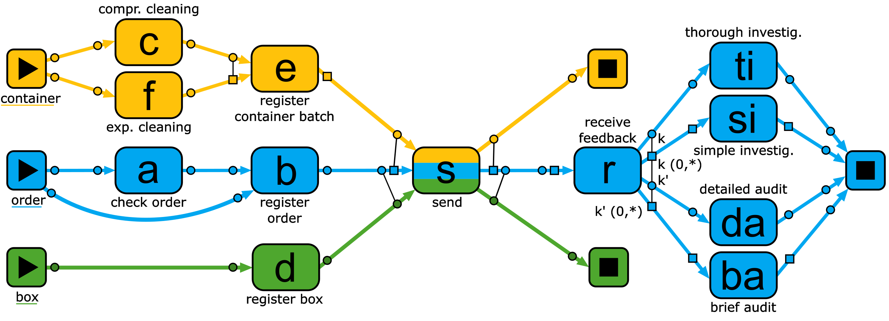
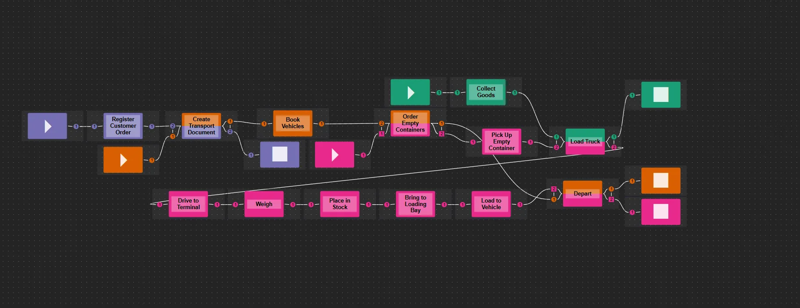
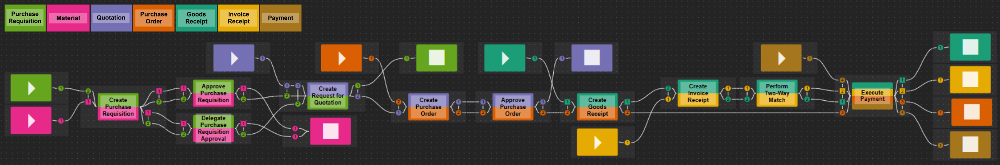
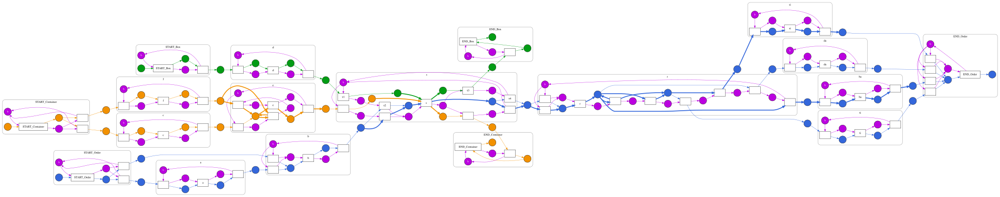
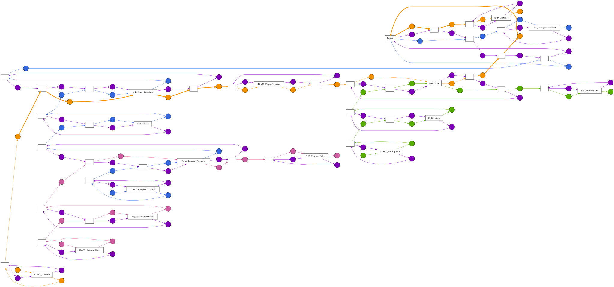
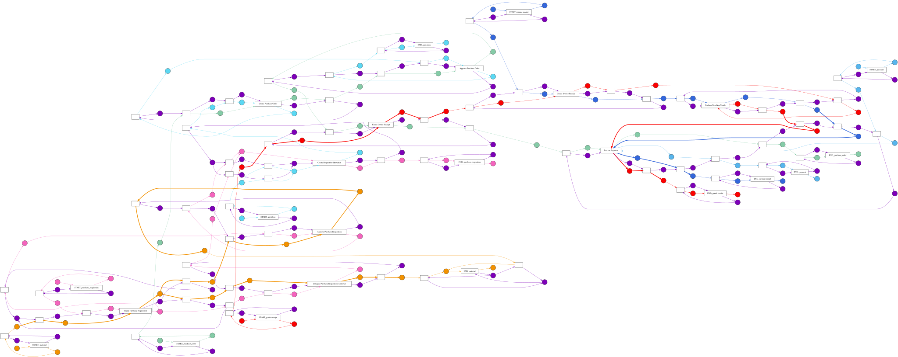
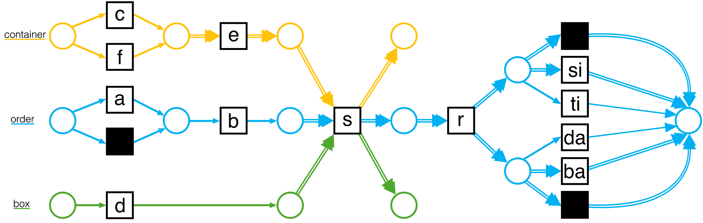
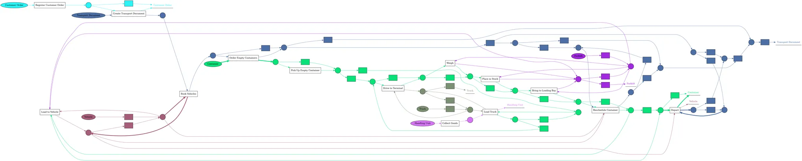
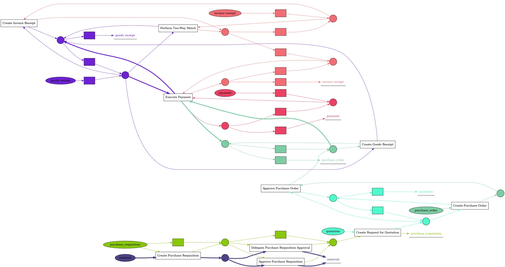
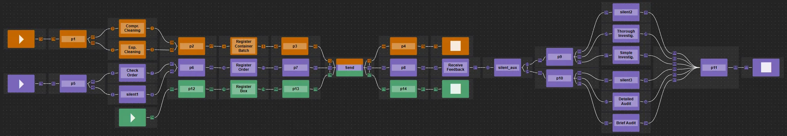

## Models used for Evaluation

In the following, the 12 models used to evaluate the OCCN-OCPN transformation qualitatively are presented alongside the number of objects per object type used for play-out. For information on the evaluation approach, please refer to the `README` file of this repository and the `evaluation/run_evaluation.py` file.

-----

### Mined OCCNs

All circular markers have cardinalities `c=(1,1)` and all square markers `c=(1, *)`, unless denoted otherwise. Markers inside a marker group share the same key if the same number is displayed inside the marker. Please note that after mining these OCCNs from an OCEL, they were manually adjusted such that their language is not empty.

**Running Example**

Note that the output marker group of `Receive Feedback` contains two pairs of markers that share keys.



*Objects for play-out:*

```json
{
  "Container": 2,
  "Order": 3,
  "Box": 1
}
```

**ContainerLogistics**



*Objects for play-out:*

```json
{
  "Customer Order": 1,
  "Transport Document": 1,
  "Container": 2,
  "Handling Unit": 2
}
```

**P2P**



*Objects for play-out:*

```json
{
  "goods receipt": 1,
  "invoice receipt": 1,
  "material": 1,
  "purchase_order": 1,
  "purchase_requisition": 1,
  "quotation": 1,
  "payment": 1
}
```

-----

### Transformed OCPNs from mined OCCNs

Please note that the global binding place has been duplicated for every activity for readability. All these duplicated places refer to the same place.

**Running Example**

Here, all duplicated global binding places are labeled *b*. These all refer to the same place.



*Objects for play-out:*

```json
{
  "Container": 2,
  "Order": 3,
  "Box": 1
}
```

**ContainerLogistics**



*Objects for play-out:*

```json
{
  "Customer Order": 2,
  "Transport Document": 2,
  "Container": 2,
  "Handling Unit": 2
}
```

**P2P**



*Objects for play-out:*

```json
{
  "goods receipt": 1,
  "invoice receipt": 1,
  "material": 1,
  "purchase_order": 1,
  "purchase_requisition": 1,
  "quotation": 1,
  "payment": 1
}
```

-----

### Mined OCPNs

These OCPNs were not adjusted after mining from OCELs (or manually constructed in the case of the running example).

**Running Example**



*Objects for play-out:*

```json
{
  "Container": 1,
  "Order": 4,
  "Box": 1
}
```

**ContainerLogistics**



*Objects for play-out:*

```json
{
  "Customer Order": 1,
  "Transport Document": 1,
  "Vehicle": 1,
  "Container": 2,
  "Truck": 1,
  "Handling Unit": 2,
  "Forklift": 1
}
```

**P2P**



*Objects for play-out:*

```json
{
  "goods receipt": 1,
  "invoice receipt": 1,
  "material": 1,
  "purchase_order": 1,
  "purchase_requisition": 1,
  "quotation": 1,
  "payment": 1
}
```

-----

### Transformed OCCNs from mined OCPNs

All circular markers have cardinalities `c=(1,1)`, square markers of places (e.g., `p1`) have cardinalities `c=(1,*)`, and square markers of transitions (e.g., `a`) have cardinalities `c=(0,*)`.

**Running Example**



*Objects for play-out:*

```json
{
  "Container": 1,
  "Order": 4,
  "Box": 1
}
```

**ContainerLogistics**

Too large for readable visualization. Please run `evaluation/run_evaluation.py` as described in the `README` file to obtain the visualization files for this model in the `evaluation/occn_visualization` directory.

*Objects for play-out:*

```json
{
  "Customer Order": 1,
  "Transport Document": 1,
  "Vehicle": 1,
  "Container": 2,
  "Truck": 1,
  "Handling Unit": 2,
  "Forklift": 1
}
```

**P2P**

Too large for readable visualization. Please run `evaluation/run_evaluation.py` as described in the `README` file to obtain the visualization files for this model in the `evaluation/occn_visualization` directory.

*Objects for play-out:*

```json
{
  "goods receipt": 1,
  "invoice receipt": 1,
  "material": 1,
  "purchase_order": 1,
  "purchase_requisition": 1,
  "quotation": 1,
  "payment": 1
}
```
